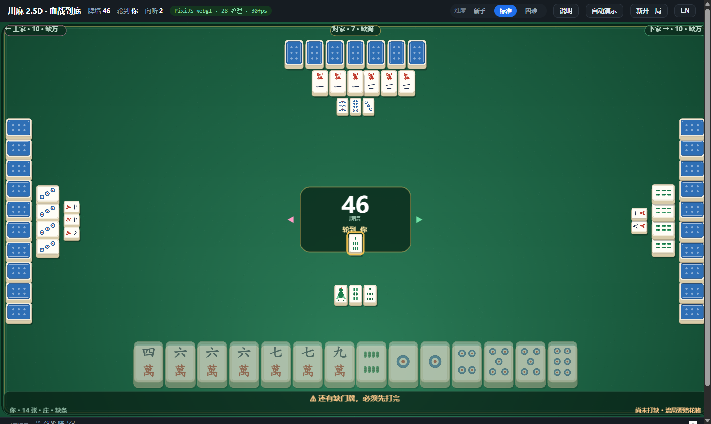

# chuan.ma · Learn Sichuan Mahjong

**A free, no-signup way for non-Chinese players to learn 川麻 — Sichuan mahjong (四川麻将, 血战到底).**

There is plenty of English material on Cantonese and Japanese mahjong. There is almost nothing on the Sichuan game, which is faster, harsher and structurally different from both. This project exists to close that gap: basic rules, tile recognition and fan scoring taught in English, backed by a real rules engine so that a learner can practise against something that actually scores like a table would.

Everything is a **static web page**. No signup, no ads, no server, no account, nothing to install. The coaching and the scoring come from a deterministic TypeScript engine — never from a language model guessing.

---

## Play it now

| | |
|---|---|
| **Start here** | <https://kyloeworks.github.io/chuan.ma/> |
| Play a game (GPU table) | <https://kyloeworks.github.io/chuan.ma/play.html> |
| Hand calculator | <https://kyloeworks.github.io/chuan.ma/calculator.html> |
| Glossary | <https://kyloeworks.github.io/chuan.ma/glossary.html> |



---

## The learning path

Four short lessons, in order. Each one assumes nothing.

| # | Lesson | What it covers |
|---|---|---|
| 1 | [**How to Play**](learn-rules.html) · 基础规则 | The 108-tile deck, declaring your **missing suit** (定缺), turn order, pong / kong / win, and how a round ends — including why the round keeps going after somebody wins. |
| 2 | [**Reading the Tiles**](learn-tiles.html) · 识别牌型 | Three suits 万 条 筒, the nine Chinese numerals, and the one tile that is drawn as a bird instead of a number. |
| 3 | [**Scoring & Fan**](learn-scoring.html) · 计算番数 | The fan table, how pattern bonuses stack, who pays on a self-draw versus a discard, kong money, and three worked examples. |
| 4 | [**Culture & Variants**](learn-culture.html) · 麻将文化 | Where the game comes from, the teahouse table, table etiquette, and the variants you will actually meet. |

Then practise:

- **[The table](play.html)** — a four-player game against three opponents, rendered on the GPU. A coaching strip along the bottom always tells you how many tiles you are from ready, which tiles you are waiting on and how many are left, which tile to discard **and why**. Three difficulty levels, and a full scoring breakdown at the end of every round.
- **[The calculator](calculator.html)** — click in any hand and instantly see how far it is from 下叫 (ready), which tiles it is waiting on, which tiles would pull it forward, and the best discard. The fastest way to build intuition for hand shape.
- **[Glossary](glossary.html)** — every term in English and Chinese with pinyin, because discards are announced in Chinese at a real table.

---

## What makes Sichuan mahjong different

| It has | It does **not** have |
|---|---|
| Only **108 tiles** — three suits, nothing else | No winds, no dragons, no flowers |
| A mandatory **missing suit** you must discard entirely (定缺) | No chow (吃) — you can never claim a discard to make a run |
| **Battle to the end**: up to **three** winners per round (血战到底) | No stopping at the first winner |
| Penalties for stalling: ready check, flower pig, tax refund | No safe, patient way to sit a round out |

With the honours stripped out, essentially the whole game is about **shape efficiency** — how fast you turn 13 random tiles into a winning hand. That is what makes it both unforgiving and unusually learnable.

---

## Repository layout

```
.
├── index.html            # site entry — start here
├── learn-rules.html      # lesson 1 · the basics
├── learn-tiles.html      # lesson 2 · tile recognition
├── learn-scoring.html    # lesson 3 · fan and points
├── learn-culture.html    # lesson 4 · culture and variants
├── glossary.html         # English ↔ Chinese term list
├── play.html             # the table (GPU, PixiJS) — self-contained, ~1.8 MB
├── calculator.html       # shanten / waits / best-discard trainer
├── tiles.html            # every tile face as vector artwork
├── site.css              # shared stylesheet for the lesson pages
│
├── kernel/               # the rules engine (TypeScript, zero dependencies)
│   ├── src/              #   tiles · shanten · ukeire · win · scoring · flow · bot · settle
│   └── test/             #   unit tests + verification harnesses
│
├── web/                  # page sources and build tooling
│   ├── content/          #   lesson page sources + shared CSS
│   ├── *.template.html   #   tool page templates
│   ├── tokens.js         #   design tokens — the only place colours live
│   ├── glyphs.js         #   GENERATED: the ten hanzi outlines the tile faces embed
│   ├── tools/            #   generators that produce the artefacts above
│   ├── tiles-ui.js       #   the 33 procedural tile faces (SVG)
│   ├── pixi-table.js     #   the GPU table renderer
│   ├── build.mjs         #   bundles a page + the engine into one HTML file
│   ├── publish.mjs       #   copies web/dist/ to the repository root
│   └── visual-*.mjs      #   visual fingerprint baseline + before/after compare
│
├── web/baseline/         # visual regression baseline (fingerprints + sheets)
│   ├── tiles.json        #   accepted fingerprint of the current artwork
│   ├── contact-sheet.png  #   all 33 faces on one sheet
│   ├── compare-before-after.png   # previous vs current, for eyeballing
│   ├── tiles-ui-v1.js    #   archived artwork (compare reference only)
│   └── tiles-ui-v2.js    #   archived artwork (compare reference only)
│
├── docs/
│   ├── ui-references.md  # what we learned from other open-source mahjong projects
│   ├── OFL.txt           # font licence for the embedded hanzi outlines
│   └── screenshot-play.png
```

The three tool pages (`play.html`, `calculator.html`, `tiles.html`) are **fully self-contained single files** — engine, styles and artwork inlined. You can download one and open it offline with no server.

---

## Run it locally

The published pages have no build step — just serve the folder:

```bash
python -m http.server 8791     # then open http://127.0.0.1:8791/
```

## Build from source

Requires Node 22.6+ (the engine is TypeScript and the tests run through Node's type stripping).

```bash
npm install                    # esbuild + pixi.js (only needed to rebuild pages)
npm run build                  # web/dist/  — bundle engine + PixiJS into each page
npm run publish                # copy web/dist/ to the repository root (the site root)
npm run serve                  # local preview on :8791
```

## Tests

The engine is the part worth trusting, so it is tested hard. All of it runs on plain Node with no test framework:

```bash
npm test                       # kernel unit tests + page smoke tests
npm run verify                 # 20k-hand independent cross-check of shanten + invariant fuzzing
npm run sim                    # 400 headless full games
npm run winrate                # seat fairness and difficulty measurement
npm run probe                  # real-browser check of the table (needs Chrome)
```

| Suite | What it proves |
|---|---|
| `kernel/test/*.test.ts` | Winning shapes, fan composition, turn flow, settlement arithmetic |
| `verify_shanten.ts` | The shanten number matches a separately written reference implementation over tens of thousands of hands |
| `fuzz.run.ts` | Invariants hold over random hands (tile counts conserved, no illegal states) |
| `sim.run.ts` | Thousands of full games complete with no deadlocks or rule violations |
| `winrate.run.ts` | Seat fairness and the strength of each difficulty tier, on paired deals |
| `browser-probe.mjs` + `pixel-audit.mjs` | The rendered table in a real browser: layout inside the canvas, seat orientation, animation counters, zero script errors — plus a pixel-level check that the left and right hands really are rotated |
| `visual-baseline.mjs` + `visual-compare.mjs` | The artwork itself: per-face fingerprint (gradient direction, colour share, detail energy) against a stored baseline, and small-size legibility where a tile is only 33 px wide |

---

## Visual assets, and how they are kept from rotting

All artwork is **generated**, not drawn: 33 SVG tile faces (27 tiles + a back) come out of `web/tiles-ui.js`, and the table itself is painted at runtime by `web/pixi-table.js`. Nothing is an image file, so nothing is stuck at one resolution.

The risk with procedural art is that it degrades silently — a colour drifts, a gradient goes the wrong way, a tile stops being legible at the small size used in the discard river, and no test notices because tests check numbers, not looks.

Four things hold the line:

| Mechanism | What it does |
|---|---|
| **`web/tokens.js`** | The single source for every colour and texture strength. The tile faces, the GPU table and all three page stylesheets read from it — the build injects it into the CSS, so a value cannot be changed in one place and left stale in another. |
| **`web/glyphs.js`** | The ten hanzi the tile faces need (一二三四五六七八九萬) as **embedded vector outlines**, generated from an OFL-licensed font by `web/tools/extract-glyphs.py`. See *Typography* below for why the faces do not use a system font. |
| **`web/visual-baseline.mjs`** | Rasterises all 33 faces and stores a **fingerprint** per tile — ink coverage, mean luminance, vertical gradient direction, colour-channel share, detail energy — in `web/baseline/tiles.json`. `npm run visual` diffs the current artwork against that baseline and names every offset, so a regression is a number rather than an opinion. |
| **`web/visual-compare.mjs`** | Emits a before/after contact sheet (`web/baseline/compare-before-after.png`) against the previously accepted artwork, plus a **three-size legibility check** (132×185 / 64×90 / 33×46) — because a tile in the river is only 33 px wide, and that is where added texture can turn into mud. |

```bash
npm run visual                       # diff artwork against the stored baseline
npm run visual:accept                # accept the current artwork as the new baseline
npm run visual:compare               # before/after contact sheet + legibility table
npm run visual:table                 # also measure the felt / rim / table colour
```

Tuning materials is done by editing `tokens.js` (`fx.*` scales gloss, felt grain density, weave strength and vignette). The drawing code contains no literal colours.

### Typography: the tile faces embed their own outlines

`萬` and the numerals used to be drawn as `<text font-family="KaiTi,STKaiti,SimSun,STSong,serif">`. That is a Windows-only stack: on Linux, Android or iOS the glyphs silently fall back to a different typeface, so the same tile looked different on every device. It also broke the moment the SVG was rasterised as an image — which is exactly what the GPU table does (`Image` → `canvas` → pixi texture) — and shipping outlines derived from a proprietary font is not ours to do.

So the outlines are extracted ahead of time and embedded:

```bash
npm run glyphs   # regenerate web/glyphs.js (needs fonttools + .cache/NotoSerifTC-Bold.otf)
```

`web/tools/extract-glyphs.py` reads a font with fontTools, normalises each glyph to its em box, and refuses to emit anything containing a path command that `fitPath()` in `tiles-ui.js` cannot transform — a mismatch there produces `NaN` coordinates, i.e. a tile that silently loses its whole face with no error anywhere. Font licence: see `docs/OFL.txt`. A consequence worth naming: the regression baseline no longer needs `loadSystemFonts`, so the same source rasterises to the same pixels on any machine.

Which projects this was learned from — and what was deliberately *not* copied — is recorded in [`docs/ui-references.md`](docs/ui-references.md).

### Layout: one scale, and an audit that measures real geometry

The nine pages used to carry four independent type scales — `h1` was 31px on the lessons, 22px in the calculator, 24px on the tile gallery — plus 20 different font sizes, 20 spacing values and 10 corner radii across the stylesheets. Nothing was *wrong*, which is exactly why it read as slightly off everywhere.

Everything now comes from one scale in `tokens.js`:

| Group | Steps | Rule |
|---|---|---|
| `--fs-*` | 12 / 13 / 14 / 15 / 16 / 18 / 22 / 28 (+40 for the one display number) | Pick the **role** (meta / small / dense / ui / body / h3 / h2 / h1); do not invent a value |
| `--sp-*` | 2 / 4 / 8 / 12 / 16 / 20 / 24 / 32 / 40 / 64 | 4px base; `hair` (2px) only for hairlines |
| `--r-*` | 6 / 12 / 20 / full | Small control / card / large panel / pill |
| `--bw-*` | 1 / 2 / 4 | Hairline outline / divider rule / accent bar — the meaning is fixed |
| `--lh-*` | 1.25 / 1.5 / 1.7 | Heading / UI / reading. Chosen by purpose, not by element |

The stylesheets contain **no literal font-size, spacing, radius or border-width** — `npm run ui:static` fails if one appears.

```bash
npm run ui          # every page × 375/768/1280/1920, real Chrome
npm run ui:static   # no browser needed: class/CSS consistency, scale, variable closure
```

`web/ui-audit.mjs` measures the rendered layout rather than reading the CSS, because the failures that matter are the ones you cannot see by reading:

- overflow past the viewport or past a parent's content box
- **sibling boxes that intersect** (compared per line-fragment, so a wrapped `<b>` does not fake a 75% overlap)
- text clipped horizontally, line-height tighter than 1.15
- tap targets below 24px (WCAG 2.5.8), with inline links in running text exempt per that same guideline
- **CSS custom properties referenced but never defined** — an undefined `var()` makes the whole declaration vanish with no error and no console warning, which is how `--sp-3xl` vs `--sp-x3l` silently disabled every `min-height` in the navigation and both tool pages

SVG internals are excluded from the geometry checks: `<rect>`/`<g>`/`<path>` inside one `<svg>` are *supposed* to overlap. Including them produced 180,000 "overlaps" that were all correct rendering, which is a good way to end up ignoring an audit entirely.

### The table's scale tier follows the stage, not the resize event

`play.html` scales every tile and every label from one factor `--k`, picked from seven tiers by comparing the stage against a 1440×720 design reference. That tier used to be computed on load and on `window.resize` only. If the window changed size *after* the page had initialised — a device-metrics override, a restored session, an early `resize` that arrived before the table was ready — the whole table stayed at the first frame's scale. Measured: stage at 1440×813 but still on the `xs` tier, `k = 0.72`, every tile and label 28% smaller than designed, and nothing reported an error.

The tier now re-derives from the stage's own size through a `ResizeObserver`, with the resulting `--k` closing a feedback loop (the header's padding is itself `--k`-scaled, so the stage height depends on the tier it produced). Re-evaluation is skipped unless the stage size actually changed and the tier actually moved, so the loop converges instead of oscillating.

`browser-probe.mjs` now exports `tier`, `uiK`, `handH` and the stage/window sizes with the screenshot geometry. Diagnosing the case above without them meant guessing at stage dimensions; with them it is one line.

## The rules engine

The lessons and the tools are driven by the same engine, so a lesson can never disagree with a score:

| Module | Responsibility |
|---|---|
| `tiles` | Tile encoding, suit/rank helpers, labels |
| `shanten` | Distance to a winning hand |
| `ukeire` | Which tiles improve the hand, and which complete it |
| `win` | Legal winning shapes — standard, seven pairs |
| `scoring` | Fan composition (平胡 · 大对子 · 清一色 · 七对 · 龙七对 · 根 · 自摸 · 杠上花 · 杠上炮 · 海底 · 十八罗汉) |
| `flow` | Declaring the missing suit, draws, discards, claims, kong handling, battle-to-the-end |
| `bot` | Three opponent personalities (easy / normal / hard) |
| `settle` | Points, kong accounting, ready check (查叫), flower pig (查花猪), tax refund (退税) |

## Ruleset, and how much to trust it

Sichuan mahjong fan values genuinely differ from table to table and city to city — all-one-suit is worth 2 in some places and 4 in others, and rare fan *names* shift too. This project therefore documents **one clearly specified preset** rather than claiming to be authoritative, and the site states its values openly on the [scoring page](learn-scoring.html) so you can compare them with your local table's house rules.

Where this repository is strict is **internal consistency**: the engine, the table, the calculator and the lessons all compute the same way, and the test suite pins that down.

---

## Deployment

The site is plain static files served from the repository root, published by the included workflow (`.github/workflows/pages.yml`) on every push to `main`.

Live at <https://kyloeworks.github.io/chuan.ma/>.

> **One-time setup note.** A brand-new repository's `GITHUB_TOKEN` is read-only by default, which caps the `pages: write` permission declared in the workflow and makes `actions/configure-pages` fail with `Resource not accessible by integration`. Fix it once under *Settings → Actions → General → Workflow permissions → **Read and write***.

### Attaching a custom domain

> ⚠️ **Order matters.** Do **not** enter a custom domain, and do not commit a `CNAME` file, until that domain's DNS actually resolves. The moment a custom domain is attached, GitHub Pages starts redirecting the working `*.github.io` URL to it — so pointing it at a domain that does not resolve takes the site offline entirely.

1. **First confirm the domain is live.**
   ```powershell
   Resolve-DnsName -Name <domain> -Type NS
   Resolve-DnsName -Name <domain> -Type A
   ```
   Real name servers and A records mean you can proceed. If you get something like `suspended1.<registrar>.net`, the domain is suspended at the registrar and nothing can be attached — that is a registrar problem, not a GitHub one.
2. **Point DNS at GitHub Pages.** Four `A` records on the apex domain:
   `185.199.108.153` · `185.199.109.153` · `185.199.110.153` · `185.199.111.153`
   plus, optionally, the matching `AAAA` records, and a `CNAME` for `www` pointing at `<owner>.github.io`.
3. **Tell Pages about it.** *Settings → Pages → Custom domain* → enter the domain → **Save**, wait for the DNS check to pass, then tick **Enforce HTTPS**.

**To remove a custom domain**, clear the *Custom domain* field and save — **deleting the `CNAME` file from the repository is not enough**, because the settings field and the file are two separate places. Browsers also cache the `301` to a former domain permanently, so verify the removal in a private window.

## Licence

No open-source licence is declared — all rights reserved. If you would like to use this under MIT or similar, please open an issue.

## 中文说明

本项目的定位是**面向非中文使用者的川麻教学工具**：从基础规则、识别牌型到计算番数，成体系地用英文讲一遍川麻（血战到底），并提供一个带教学提示的 GPU 牌桌让你真的打得起来。

站点为纯静态页面，规则与提示全部来自自研 TypeScript 规则引擎（无 AI 参与判牌）。番值等存在地区差异的参数集中在一处并公开说明，站点内自洽；同时只保留**一个**牌桌（`play.html`）持续打磨视觉与手感。
