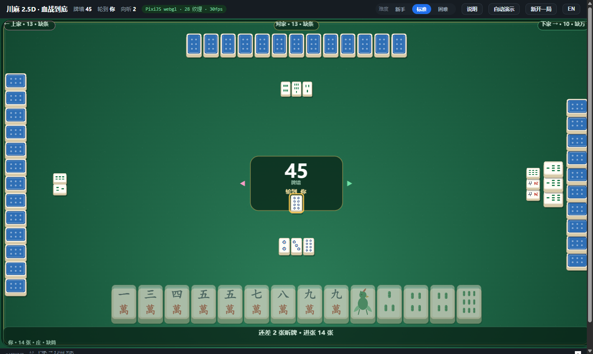

# Chuan Ma · 川麻工具集

纯前端、零后端的**四川麻将（血战到底）**学习工具集。每个页面都是**自包含的单文件 HTML**——无需构建、无需服务器、无需登录，离线双击即可运行。

规则内核为自研 TypeScript 川麻引擎，**不含任何 AI / 机器学习成分**，全部判断来自确定性规则计算。

---

## 在线访问

| 页面 | 链接 |
| --- | --- |
| **站点首页** | <https://kyloeworks.github.io/chuan.ma/> |
| 牌桌 · 2.5D（GPU） | <https://kyloeworks.github.io/chuan.ma/chuanma-table-2p5d.html> |
| 牌桌 · 经典版（DOM） | <https://kyloeworks.github.io/chuan.ma/chuanma-table.html> |
| 向听计算器 | <https://kyloeworks.github.io/chuan.ma/chuanma-calculator.html> |
| 牌面资产总览 | <https://kyloeworks.github.io/chuan.ma/tiles.html> |



---

## 四个工具

### 1. 向听计算器

输入手牌，实时算出**向听数**、**听牌张**与**进张**，并给出「该打哪张」。适合练牌感、验证自己的判断。

### 2. 牌桌 · 2.5D（GPU，PixiJS）

四家围坐的圆桌，左右两家手牌**横置朝心**（牌顶永远指向桌心）。

- **动效**：发牌轨迹（52 张从桌心依次飞向四家）、出牌贝塞尔飞行、碰/杠金色扩散高光环、胡牌金色粒子爆发
- **版式**：所有人打出的牌在门前**按序摆两排**；刚摸的牌单独排在**右手边**，一弃牌自动归位
- **教学条**（底部常驻）：`还差 2 张听牌 · 进张 12 张`；听牌时列出**所听之牌 + 各剩几张**（以金框虚线「幽灵牌」摆出）；轮到你时给出可解释的理由 `★ 打 8万 → 进张 16 张`
- **三档难度**：新手 / 标准 / 困难
- **分数结算**：终局给出每家净分（正分红 / 负分绿）+ 分项明细

### 3. 牌桌 · 经典版（DOM）

纯 DOM/SVG 实现，最轻、最稳、可离线。功能与 2.5D 版一致（定缺 / 碰杠 / 亮牌 / 教学条 / 难度分级 / 分数结算 / 自动演示 / 中英双语）。

### 4. 牌面资产总览

33 个程序化生成的 SVG 牌面（万 / 条 / 筒 各 1–9，加牌背）：矢量、任意尺寸清晰、免授权，含实战尺寸预览与接入说明。

---

## 规则内核

| 模块 | 职责 |
| --- | --- |
| 向听 / 进张 | 手牌向听数与有效进张计算 |
| 和牌判定 | 平胡、七对、清一色、碰碰胡、根、金钩钓等番型 |
| 对局流程 | 定缺 → 摸打 → 鸣牌（碰/杠/胡）→ 血战到底 |
| 结算 | 番→分换算、杠分记账、流局查大叫、查花猪、退税 |

**正确性验证**：向听数经 **5 万手独立参考实现对照 + 不变量 fuzz 测试**校验；规则流、番型、结算均带单元测试。

---

## 仓库结构

```
.
├── index.html                  # 站点首页（入口）
├── chuanma-table-2p5d.html     # 牌桌 · 2.5D（PixiJS，单文件约 1.8 MB）
├── chuanma-table.html          # 牌桌 · 经典版（DOM，单文件约 90 KB）
├── chuanma-calculator.html     # 向听计算器
├── tiles.html                  # 牌面资产总览
├── docs/
│   └── screenshot-2p5d.png     # 2.5D 牌桌实机截图
└── .github/workflows/pages.yml # 推送到 main 自动发布到 GitHub Pages
```

---

## 本地运行

站点无构建步骤，任选其一：

```bash
# 方式一：直接双击任一 .html 文件

# 方式二：起个静态服务器（推荐，避免个别浏览器的本地文件限制）
python -m http.server 8791
# 然后打开 http://127.0.0.1:8791/
```

---

## 部署

推送到 `main` 分支即自动发布（GitHub Actions 会把根目录下的网页文件发布到 GitHub Pages）。
也可以在 **Actions → Deploy static site to GitHub Pages → Run workflow** 手动触发。

---

## 浏览器要求

- **2.5D 牌桌**：需要 WebGPU 或 WebGL2（现代 Chrome / Edge / Safari / Firefox 均可）。若渲染器不可用，页面会显示诊断信息，建议改用经典版。
- **其余页面**：任意现代浏览器。

## 许可

未声明开源许可，保留所有权利。如需以 MIT 等许可开放，请提 Issue 或直接联系作者。
